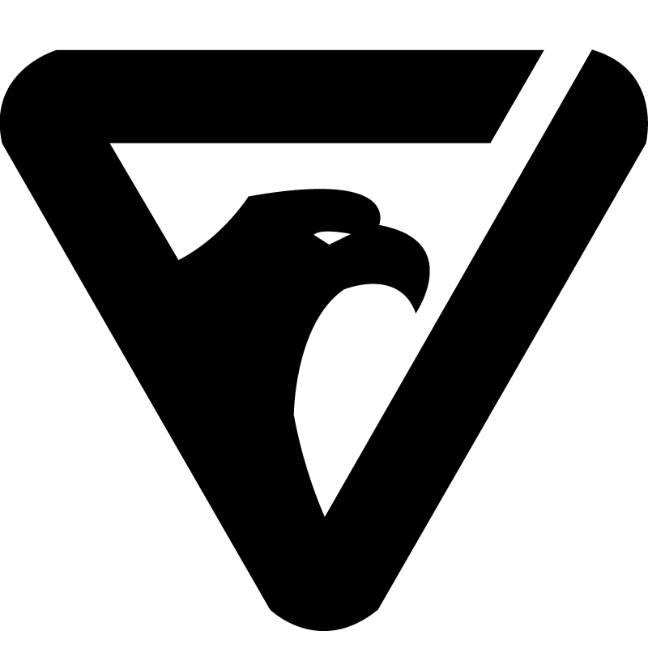

# FalconJS Logo
Available in SVG and PNG Format

Git [Falcon-JS](https://github.com/falcon-js/falcon)

Website [www.falconjs.io](https://www.falconjs.io)


## Official Colors

|Purple | Black | White |
|-------|-------|-------|
| |  | 
|```FALCONJS-LOGO-992FFF.png``` | ```FALCONJS-LOGO-FFFFFF.png``` | ```FALCONJS-LOGO-000000.png```|
| ```#992FFF``` | ```FFFFFF``` | ```000000```| 

